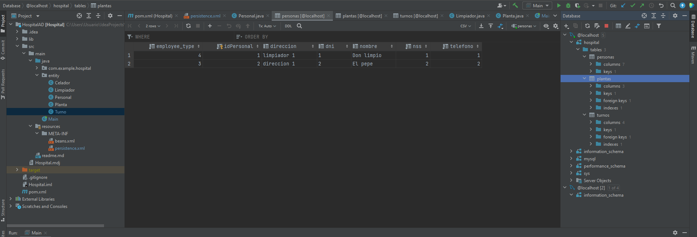
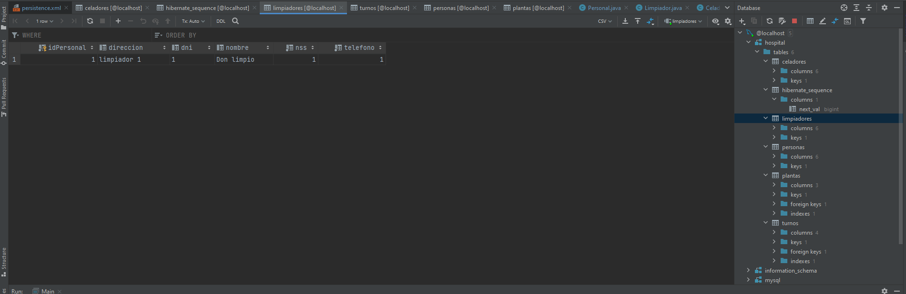
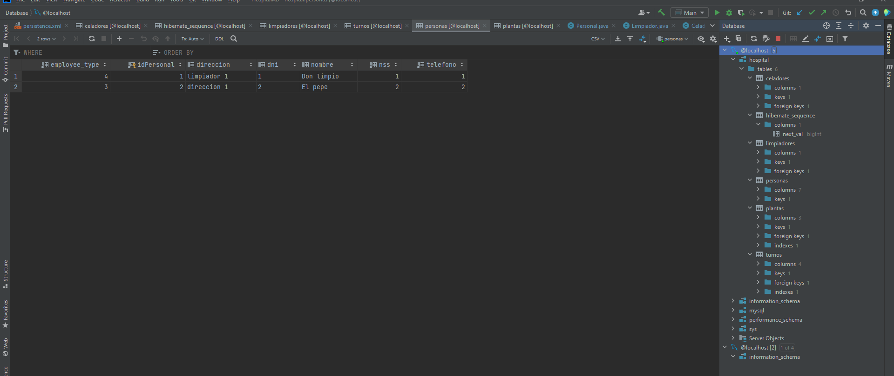

# HospitalAD
EjercicioDelHospital

### Capturas

1. Single Table

2. Table per Class

3. Joined

### Solución

En este Ejercicio es mejor usar Single Table por que:

En nuestro caso las Clases hijas no tienen las relaciones en la base de datos
por lo que no se generarían campos NULL y así tendríamos el menor número de tablas

Por César Domínguez Rodríguez , Adrián Fernández Pérez y Gael Rey Fernandez
